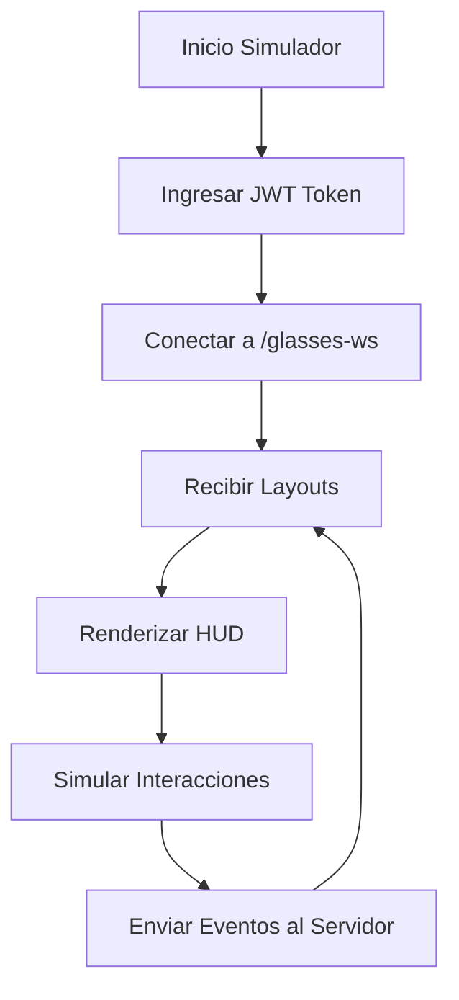

## 1. Product Overview
Cliente simulador de gafas Mentra para probar aplicaciones de MentraOS. Renderiza layouts en una ventana de escritorio como HUD (Heads-Up Display) y permite interactuar con las aplicaciones mediante controles simulados.

- Permite a desarrolladores probar aplicaciones de MentraOS sin necesidad de tener las gafas físicas
- Simula la experiencia de usuario real con visualización HUD y controles de cabeza/botones

## 2. Core Features

### 2.1 User Roles
| Role | Registration Method | Core Permissions |
|------|---------------------|------------------|
| Developer | JWT token authentication | Connect to /glasses-ws, test applications, simulate interactions |

### 2.2 Feature Module
El simulador de gafas Mentra consiste en las siguientes páginas principales:
1. **Ventana HUD**: Renderiza los layouts de las aplicaciones en formato HUD
2. **Panel de Control**: Controles para simular head_position y button_press
3. **Conexión**: Gestión de conexión WebSocket con autenticación JWT

### 2.3 Page Details
| Page Name | Module Name | Feature description |
|-----------|-------------|---------------------|
| Ventana HUD | HUD Renderer | Renderiza layouts recibidos de MentraOS en formato de superposición transparente. Muestra elementos UI como texto, imágenes, botones virtuales. |
| Panel de Control | Head Tracker | Simula movimiento de cabeza con controles deslizantes para pitch, yaw, roll. Envía head_position events al servidor. |
| Panel de Control | Button Simulator | Botones virtuales para simular button_press events (power, select, back, up, down). |
| Conexión | WebSocket Client | Conecta a /glasses-ws endpoint con JWT token. Gestiona reconexión automática y estado de conexión. |

## 3. Core Process
**Flujo de Desarrollador:**
1. Desarrollador inicia el simulador
2. Ingresa JWT token para autenticación
3. Se conecta a /glasses-ws endpoint
4. Recibe layouts de aplicaciones MentraOS
5. Interactúa con controles simulados (head movement, buttons)
6. Los eventos se envían al servidor para procesar

## 4. User Interface Design

### 4.1 Design Style
- **Colores**: Fondo transparente/negro para HUD, acentos en azul Mentra (#0066FF)
- **Estilo de botones**: Minimalista, bordes redondeados, efecto hover
- **Tipografía**: Sans-serif moderna (Inter/Roboto), tamaños 12-16px para HUD
- **Layout**: Overlay flotante, ventana siempre encima, bordes redondeados
- **Iconos**: Estilo outline, consistencia con sistema MentraOS

### 4.2 Page Design Overview
| Page Name | Module Name | UI Elements |
|-----------|-------------|-------------|
| Ventana HUD | HUD Renderer | Ventana flotante transparente (800x600px), elementos UI con opacidad 80%, sistema de grillas para layouts |
| Panel de Control | Head Tracker | Sliders numéricos para pitch (-90° a 90°), yaw (-180° a 180°), roll (-90° a 90°), botón reset |
| Panel de Control | Button Simulator | Botones físicos virtuales: Power (rojo), Select (verde), Back (gris), Up/Down (flechas), con feedback visual |
| Conexión | Status Bar | Indicador de conexión (verde/rojo), dirección WebSocket, botón conectar/desconectar |

### 4.3 Responsiveness
- Diseño desktop-first optimizado para desarrolladores
- Ventana HUD redimensionable manteniendo proporción 4:3
- Panel de control adaptable a diferentes tamaños de pantalla
- Optimizado para uso con ratón y teclado