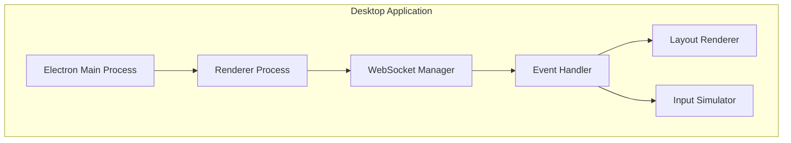
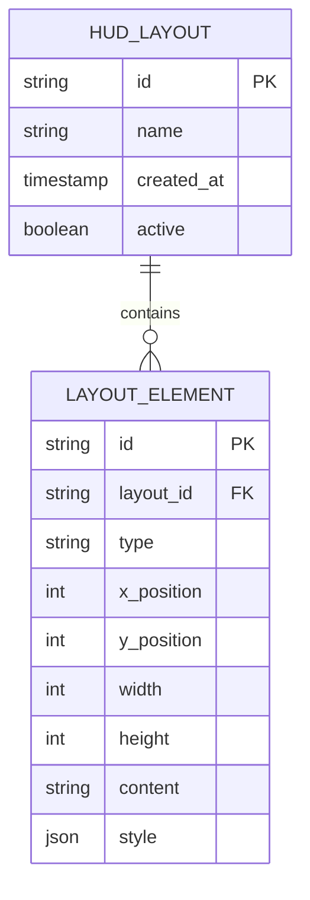

## 1. Architecture design

```mermaid
graph TD
  A[User Browser] --> B[React Desktop App]
  B --> C[WebSocket Client]
  C --> D[/glasses-ws Endpoint]
  
  subgraph "Frontend Layer"
    B
    C
  end
  
  subgraph "MentraOS Service"
    D
  end
```

## 2. Technology Description

- Frontend: React@18 + Electron@27 + TypeScript
- Initialization Tool: create-react-app with electron-builder
- UI Framework: TailwindCSS@3 + HeadlessUI
- WebSocket: Native WebSocket API with reconnect logic
- Build Tool: Vite

## 3. Route definitions

| Route | Purpose |
|-------|---------|
| / | Main HUD viewer window, renders application layouts |
| /control | Control panel for head tracking and button simulation |
| /connect | Connection settings and JWT authentication |

## 4. API definitions

### 4.1 WebSocket Events

**Connection Authentication**
```javascript
// Connection message
{
  type: 'auth',
  token: 'jwt_token_here'
}

// Auth response
{
  type: 'auth_status',
  status: 'success' | 'failed',
  message?: string
}
```

**Layout Rendering**
```javascript
// Layout update from server
{
  type: 'layout_update',
  layout: {
    id: string,
    elements: Array<{
      type: 'text' | 'image' | 'button',
      position: { x: number, y: number },
      size: { width: number, height: number },
      content: string,
      style?: object
    }>
  }
}
```

**Head Position Events**
```javascript
// Head position update to server
{
  type: 'head_position',
  data: {
    pitch: number, // -90 to 90 degrees
    yaw: number,   // -180 to 180 degrees
    roll: number   // -90 to 90 degrees
  }
}
```

**Button Press Events**
```javascript
// Button press to server
{
  type: 'button_press',
  button: 'power' | 'select' | 'back' | 'up' | 'down'
}
```

## 5. Server architecture diagram



## 6. Data model

### 6.1 Data model definition



### 6.2 TypeScript Interfaces

```typescript
interface LayoutElement {
  id: string;
  type: 'text' | 'image' | 'button';
  position: { x: number; y: number };
  size: { width: number; height: number };
  content: string;
  style?: Record<string, any>;
}

interface HUDLayout {
  id: string;
  elements: LayoutElement[];
}

interface HeadPosition {
  pitch: number; // -90 to 90
  yaw: number;   // -180 to 180
  roll: number;  // -90 to 90
}

interface WebSocketMessage {
  type: string;
  data?: any;
}
```